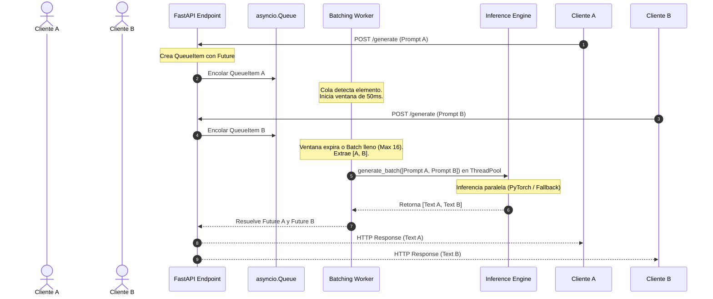

# LLM Inference Server

Servidor de inferencia de alto rendimiento optimizado para la ejecucion de modelos de lenguaje causal. Este modulo implementa tecnicas avanzadas de gestion de concurrencia y optimizacion de throughput, especificamente agrupamiento dinamico de peticiones (Dynamic Request Batching) y transmision de respuestas token a token (Streaming) mediante Server-Sent Events (SSE).

El servidor esta disenado para ser compatible tanto con aceleradores locales (MPS/CUDA) cargando modelos CausalLM de Hugging Face, como con entornos offline sin recursos de GPU, gracias a un motor de contingencia semantica determinista.

## Arquitectura del Sistema y Dynamic Batching

La arquitectura del servidor esta optimizada para mitigar el cuello de botella tradicional en inferencia de LLMs: la transferencia de pesos de la memoria global (VRAM/RAM) a las unidades de calculo del procesador (ALUs).



### 1. Mecanismo de Dynamic Request Batching

En lugar de procesar cada peticion de inferencia de forma secuencial (generando un sobrecoste critico al cargar los pesos del modelo por cada consulta) o rechazar peticiones concurrentes, el servidor implementa un despachador asincrono en segundo plano:

1.  **Encolado Asincrono:** Cada peticion entrante al endpoint `/generate` genera una estructura `QueueItem` que encapsula el prompt, la cantidad maxima de tokens a generar, y un objeto `asyncio.Future`. El item se inserta en una cola thread-safe `asyncio.Queue`.
2.  **Ventana de Agrupamiento:** Al ingresar un elemento a la cola vacia, el `dynamic_batch_worker` despierta e inicia un bucle de espera de duracion configurable ($\tau = 50\text{ ms}$). Durante esta ventana, recolecta de forma no bloqueante todas las peticiones concurrentes subsiguientes.
3.  **Restricciones de Lote:** El worker detiene la acumulacion de elementos si la ventana temporal expira o si el lote alcanza el tamano maximo permitido ($N_{\text{max}} = 16$).
4.  **Ejecucion en Ejecutor de Hilos (Thread Pool):** La inferencia de modelos de Deep Learning bloquea el Global Interpreter Lock (GIL) de Python al realizar calculos pesados en C++/CUDA. Para evitar congelar el bucle de eventos asincrono de FastAPI, la ejecucion del lote se delega a un ejecutor externo mediante `loop.run_in_executor(None, engine.generate_batch, prompts, max_tokens)`.
5.  **Despacho y Resolucion:** Al finalizar la inferencia en lote, el worker asocia las respuestas decodificadas a sus respectivos `Futures`, notificando y liberando las peticiones HTTP suspendidas.

### 2. Streaming de Inferencia mediante Server-Sent Events (SSE)

Para optimizar el tiempo hasta el primer token (TTFT - *Time to First Token*), el endpoint `/generate_stream` expone una conexion persistente unidireccional utilizando el protocolo Server-Sent Events (SSE). El flujo de tokens se gestiona de la siguiente manera:

*   El servidor inicializa un generador que consume el motor de inferencia.
*   En cada iteracion del generador, se emite un fragmento de texto (token o subpalabra) encapsulado en un evento de tipo `token` estructurado como JSON:
    ```json
    {
      "event": "token",
      "id": "uuid-v4-identificador",
      "data": "siguiente_palabra "
    }
    ```
*   Al concluir la generacion, el flujo envia un mensaje de control `"data": "[DONE]"` con evento `done` y cierra la conexion de forma segura.

### 3. Motor de Inferencia y Fallback Offline

El modulo `InferenceEngine` gestiona la abstraccion del hardware. Admite dos modos operativos:

*   **Modo Online / Local:** Carga modelos basados en arquitectura CausalLM (por ejemplo, `sshleifer/tiny-gpt2`) mediante PyTorch y Transformers en la plataforma de computo mas veloz disponible en el sistema (MPS en hardware Apple Silicon, CUDA en sistemas Nvidia, o CPU de forma generalizada).
*   **Modo de Simulacion / Fallback Offline:** Si el entorno carece de recursos de GPU, conexion para descargar pesos, o si fallan las dependencias del compilador, se activa un motor heuristico semantico. Este motor analiza la presencia de tokens clave en el prompt para estructurar respuestas coherentes sobre conceptos de IA a una tasa simulada de generacion (usando retardos aleatorios entre `0.01` y `0.04` segundos por palabra para replicar el comportamiento de streaming real).

## Conexión con el Ecosistema

Dentro de la suite **ai-core-infra**, este servidor cumple funciones criticas:
1.  **semantic-model-router:** El router semantico analiza las peticiones entrantes de los clientes y las redirige hacia este servidor de inferencia o hacia APIs propietarias externas basandose en la complejidad y sensibilidad de la query.
2.  **orchestra-agents:** Los agentes y planificadores asincronos realizan consultas recurrentes y concurrentes a este modulo para resolver reflexiones, invocar herramientas y sintetizar observaciones sin penalizar los hilos principales de ejecucion.

## Estructura de Archivos

*   `inference_engine.py`: Modulo encapsulado que maneja la carga del modelo de Hugging Face, la tokenizacion por lotes, la inferencia acelerada por hardware y los metodos de simulacion offline.
*   `server.py`: Definicion del servidor FastAPI, implementacion del despachador dinamico (`dynamic_batch_worker`) y de los endpoints de comunicacion.
*   `test_server.py`: Suite de test unitarios asincronos que validan el comportamiento concurrente del batching, el comportamiento ante errores e hilos cancelados, y el correcto funcionamiento del streaming SSE.
*   `example.py`: Script interactivo cliente-servidor que inicializa el servidor FastAPI, envia peticiones secuenciales y simula rafagas concurrentes para demostrar el dynamic batching visualizando logs en vivo.

## Instalacion y Servido

### 1. Instalar Dependencias

Asegurese de habilitar el entorno virtual del proyecto antes de realizar la instalacion:

```bash
python3 -m venv .venv
source .venv/bin/activate
pip install -r requirements.txt
```

### 2. Ejecutar Pruebas Automatizadas

La suite de pruebas simula la llegada de peticiones concurrentes y verifica que sean agrupadas y resueltas correctamente en un unico lote de ejecucion:

```bash
.venv/bin/python -m unittest test_server.py
```

### 3. Arrancar el Servidor Local

Puede iniciar el servidor FastAPI directamente usando Uvicorn:

```bash
.venv/bin/python -m uvicorn server:app --host 127.0.0.1 --port 8000 --log-level info
```

### 4. Demostracion en Vivo (Dynamic Batching)

Con el servidor corriendo en una terminal, ejecute en otra terminal activa:

```bash
.venv/bin/python example.py
```

Este script disparara multiples llamadas en paralelo de forma asincrona para observar el agrupamiento dinamico reduciendo la latencia media y mostrando la emision del streaming por consola.
